<style>
    img {
        
    }
</style>

## tracking milestones with tags

As you are working you way through your project, there may be certain points in your journey that you may regard as milestones. This could be a major release in your software or even a simple bug fix. These milestones can be recorded with the help of something called as tags. The `git tag` command helps you to mark certain milestones in a project. Here are few tricks you can perform with git's tagging feature.

**comparing version changes**
Keep in mind that tags although behave like branches, they do not allow you to make changes. That is what sets them apart. This gives you an apparent advantage that allows you to make comparison and track you progress from one version to another. Let's take an example to demonstrate this.

We will make a new directory and initialize a git repository.

```bash
mkdir myapp && cd myapp
git init
```

Now let us create a simple hello_world python module.

```python
def hello_world():
    print("Hello World")

if __name__ == "__main__":
    hello_world()
```

This will be our v1.0 release of the application. 

```bash
git add hello_world.py
git commit -m "added hello_world.py"
git tag v1.0
```

This will create a milestone in our commit history with name an identifier "v1.0". A quick `git log --oneline` should show this:


Now let's make some changes to our application to print a name of the user with the hello message and add a new commit.

```python
def hello_world(name: str):
    print(f"Hello {name}")

if __name__ == "__main__":
    name = "Vignesh"
    hello_world(name)
```

```bash
git commit -am "added name to hello world"
```

Now our application is able to greet the user. But hold on. The name of the user is static. We need to be able to get the name of the user as an input from the user.

```python
def hello_world(name: str):
    print(f"Hello {name}")

if __name__ == "__main__":
    name = str(input("Enter your name: "))
    hello_world(name)
```

This looks like a good version to release as an increment to our previous version. Lets commit it and create a tag.

```bash
git commit -am "added user input for name"
git tag v2.0
```

So far we created a hello world app and rolled out two releases. Now you need to track the progress of your code from v1.0 to v2.0.

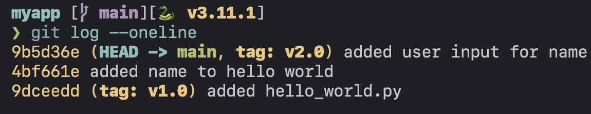

The `diff` command allows you to track all your changes.

```bash
git diff v1.0..v2.0
```

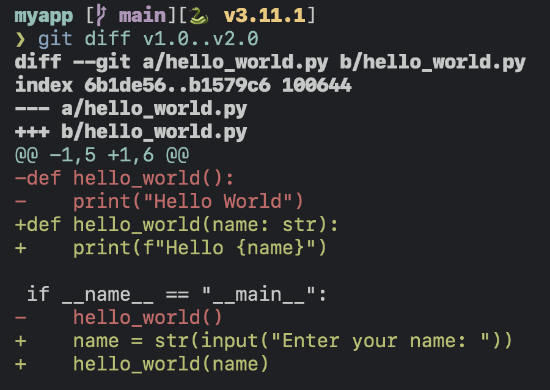

The cool thing about tags is that they exist even if the commit is lost or deleted. Let's purposely get rid of our most recent commit. Run below command with caution, for it can get rid of hours of effort. It is equivalent to pressing the delete button on the current commit without an "undo" button.

```bash
git reset --hard HEAD^
git log --oneline
```

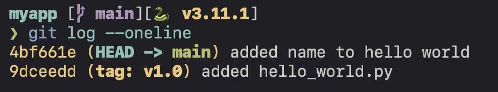

Now it seems to appear that our tag v2.0 was lost. Let's do a `git tag -l`. You will notice that our tag still exists. If you do a `git show v2.0`, it should show the latest version of the code that we purposely got rid of.

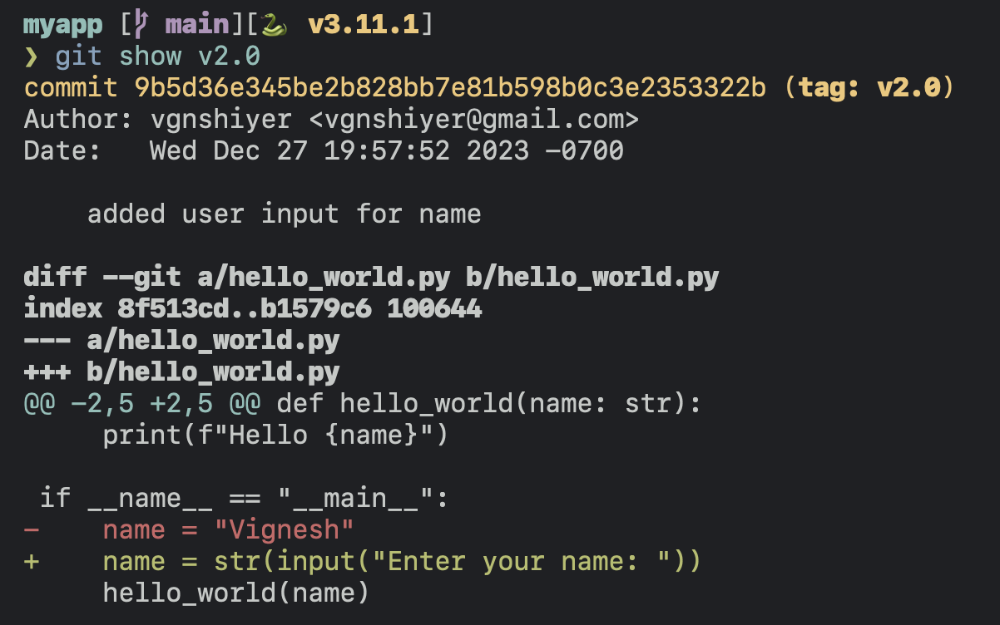

As you can see, git has still preserved our commit because of our tag. We can easily recover it by replaying it over our main branch, using the `rebase` (more on that later) command.


Other useful way that I most like to use tags is automatically triggering CICD pipelines to publish you code, whenever you tag a commit with a new version of your package. For example, you can create a github action workflow to automatically publish the latest version of your package to a central repository like PyPi on a new release. Here is an [example.](https://github.com/vgnshiyer/py-apple-books/blob/main/.github/workflows/publish.yml)

**Reverting commits**
Now let's say we want to ignore the previous commit where we added a static `name` variable. We can do this with the help of the `revert` command.

Let's add two more commits to our history to demonstrate this.

```bash
touch deleteme.txt
git add deleteme.txt && git commit -m "revert this commit"
echo "#this is a comment in python" >> hello_world.py
git commit -am "added comment to hello world"
```

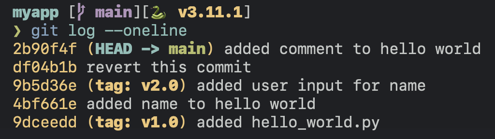

```bash
git revert HEAD^
```

The `revert HEAD^` tells git to revert (HEAD-1)th commit from our history. As soon as you enter a commit message you may notice that it adds a new commit to our history. 

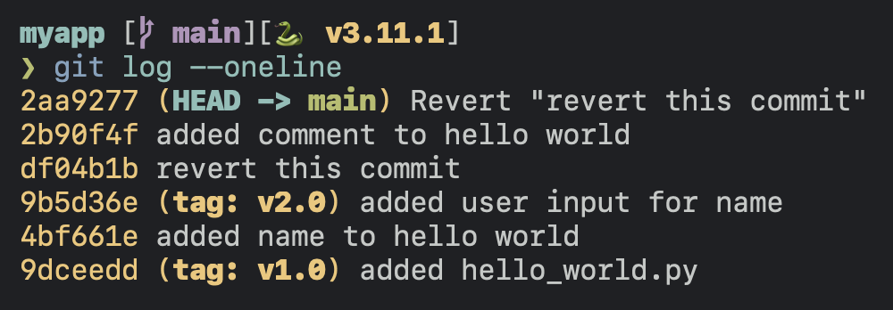

While this helps you keep track of the reverted commit, it may sometimes seem to be polution the commit history of our application. Below are two ways to completely get rid of the commit from the history. 

**Interactive rebasing**

The `-i` flag of the `git rebase` command allows us to interactively rewrite the history of our application. Entering the command with the `-i` flag, you should see something like this.

```bash
git rebase -i HEAD~3
```

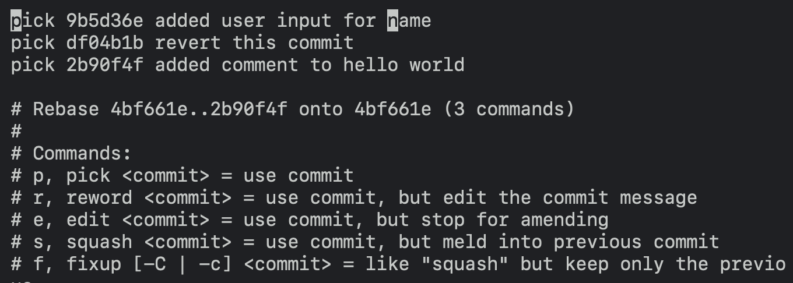

Remove the line with the commit which added the "deleteme.txt" file. Now the commit log looks something like this.

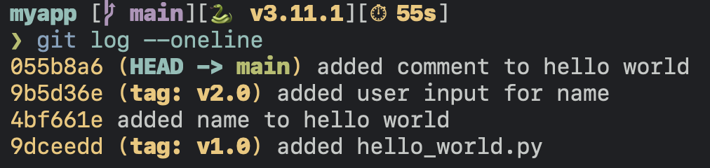

**Resetting**

Another way to remove a bad commit is to use the reset command which we saw earlier. The main difference between this command and the `revert` command is that `reset` wipes all the commits from the HEAD to the specified commit. While this helps you get rid of a bad commit, it can lead to you losing valuable information about the history of your project.

This [stackoverflow](https://stackoverflow.com/a/27032988) question explains it tersely.

Again, wisely use the `--hard` flag with the `reset` command. I have lost hours of my effort with this mistake and I have the scar tissue to prove it.

## Working with branches

It is often difficult to work on the same codebase, especially when you have a large team. Branching is an easy way to isolate works by different developers, or works by different feature or a bug fix. Based on the nature of the problem and usecase, a gamut of issues may arise. That is the time for you to rise up and showcase your prowess of working with Git.

**Squashing merge**

Let's borrow our example from above and build on it. We want to add a new experimental feature to our hello_world application. Since this is an experimental feature, we will maintain a separate branch while not disturbing our main.

```bash
git checkout -b experimental
```

Let's add a new function that greets good morning.

```bash
touch good_morning.py
git add good_morning.py && git commit -m "added good_morning.py"
```

```python
# good_morning.py
def good_morning():
    print("Good morning")

if __name__ == "__main__":
    good_morning()
```

```bash
git commit -am "added good morning greeting"
```

Our commit log looks something like

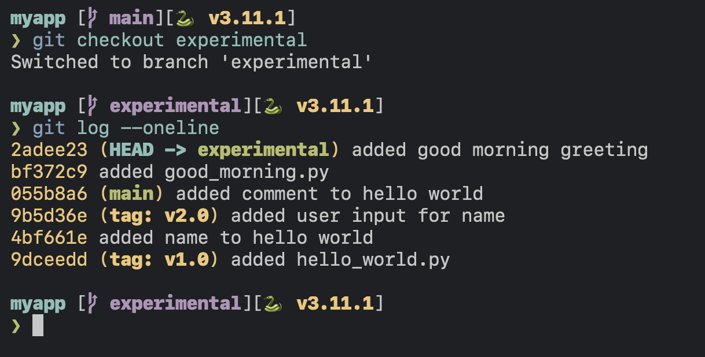

Now we are ready with our changes for the experimental changes, and are ready to merge. However, we want to keep the history of our main branch clean with only meaningful commit. The two commits we added above are redundant, and could have been done with only one commit. This is where we use Squashed merge commit. To squash merge a branch into another, we do the following:

```bash
# checkout the branch you want to merge with
git checkout main
# merge the branch to be merged
git merge experimental --squash
git status
```

You will notice that our experimental updates were staged. We will create a new squash commit with all the changes from the "experimental" branch with a single commit.

```bash
git commit -m "squashing experimental into 1 commit"
```

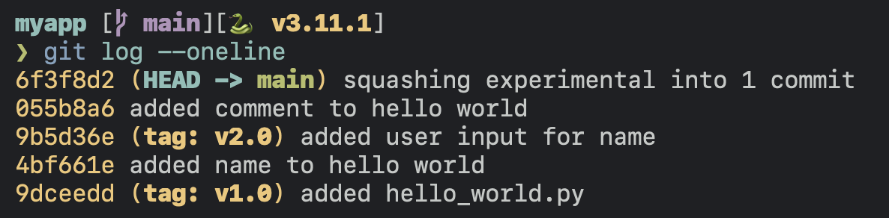

Visually this would look something like this.

```
* Squashed merge
          D--E
         /
  A--B--C------F <-- (squashed merge commit that includes D & E)

* Normal merge commit with no fast-forward
          D--E
         /    \
  A--B--C------F <-- (normal merged commit with --no-ff)

* Normal merge commit with fast-forward enabled
          
  A--B--C--D--E
```

A normal merge commit log with fast-forward.

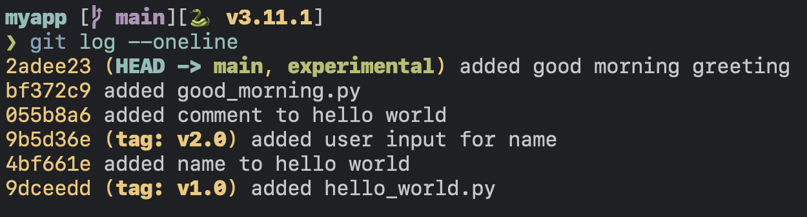

This is really useful because it keeps the history of the application clean by squashing commits while preserving separate history of our other branch. If a branch contains an individual change or a bug fix, it is a good candidate for squash merge. However, if the branch contains multiple changes and the history of which needs to be preserved, a normal merge or a rebase should be appropriate.

Biggest learnings:

Rebasing only moves changes from a branch on the tip of the branch you are rebasing onto. In order to incorporate the changes, you will have to merge.

rebase + merge
-> If main drifted ahead, git rebase feature will change move the branch from the previous diverging point to the current tip of the master.
  \--> This means now you can easily fast forward merge feature to main to have a clean history.

-> merging master onto feature is another method where all commits from feature are brought behind the tip of master. However, this is not a common workflow. We mostly rebase feature onto master.

Rebase + Merge: This is a two-step process. First, you rebase your feature branch onto the target branch, then you merge the feature branch into the target branch. This results in a linear history.

```
Before rebase:
A--B--C (master)
    \
     D--E (feature)

After rebase:
A--B--C (master)
     \
      D'--E' (feature)

After merge:
A--B--C--D'--E' (master & feature)
```

Rebase: This moves or combines a sequence of commits to a new base commit. It's like saying "I want to base my changes on what everybody else has already done."
```
Before rebase:
A--B--C (master)
    \
     D--E (feature)

After rebase:
A--B--C (master)
     \
      D'--E' (feature)
```

Merge: This takes the contents of a source branch and integrates it with the target branch.
```
Before merge:
A--B--C (master)
    \
     D--E (feature)

After merge:
A--B--C
     \   \
      D--E--F (master)
```

Squash Merge: This takes all the file changes and combines them into one commit in the target branch.
```
Before squash merge:
A--B--C (master)
    \
     D--E (feature)

After squash merge:
A--B--C--F (master)
    \
     D--E (feature)
```

Squash Rebase: This is similar to a regular rebase, but all changes from the feature branch are squashed into a single new commit on the target branch.
```
Before squash rebase:
A--B--C (master)
    \
     D--E (feature)

After squash rebase:
A--B--C--F (master)
    \
     D--E (feature)
```

**Cherry pick**

4. squash commit / cherry picking / rebasing

8. squashing multiple commits into one

9. partially adding hunks to staging area

10. git fetch